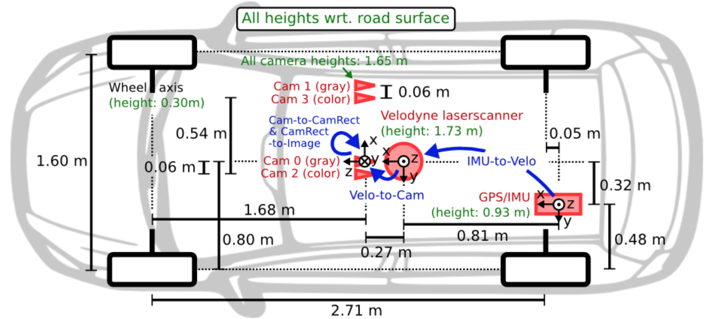
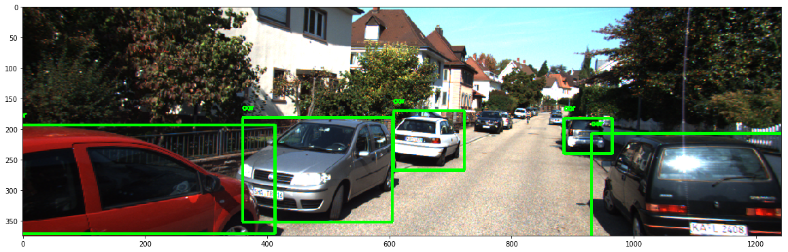
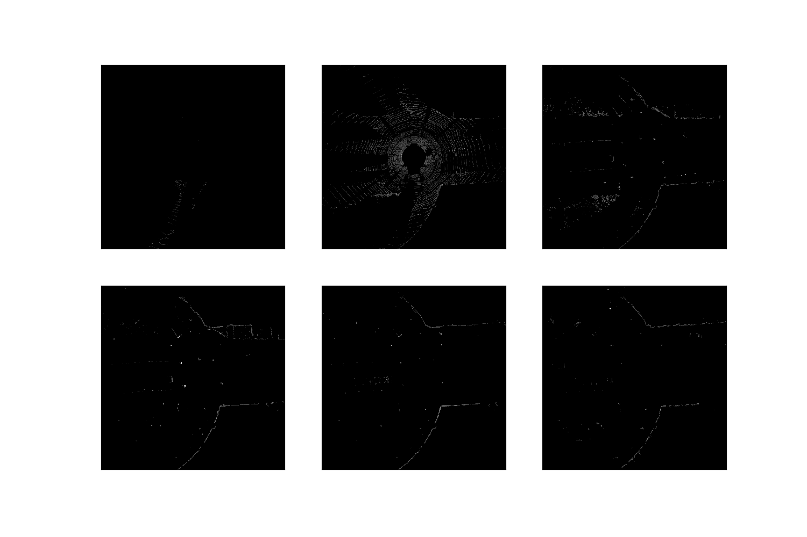
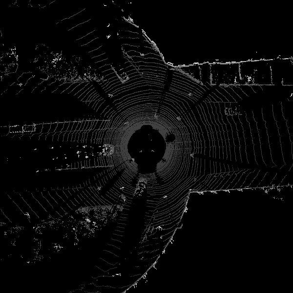
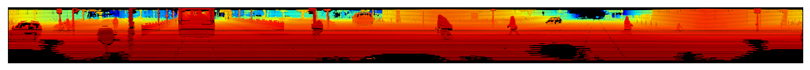
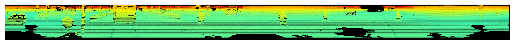

## AdvancedObjectDetection -  *An ongoing quest for real time 3D object detection*

 
 Velodyne point cloud bird view projection      |  2D object detection (YOLOv2)
:-------------------------:|:-------------------------:
  |  
 

**Velodyne point cloud front view reflectance projection**


### **Dataset description**

The dataset used here to explore the possibities of 3D object detection is from the KITTI Vision Benchmark Suite.

The dataset has multiple sources of data - various sensors and cameras. As per thier website, following are the equipments used to collect the data.

    1 Inertial Navigation System (GPS/IMU): OXTS RT 3003
    2 Laserscanner: Velodyne HDL-64E
    3 Grayscale cameras, 1.4 Megapixels: Point Grey Flea 2 (FL2-14S3M-C)
    4 Color cameras, 1.4 Megapixels: Point Grey Flea 2 (FL2-14S3C-C)
    5 Varifocal lenses, 4-8 mm: Edmund Optics NT59-917

The set up of all these sensors and cameras on Volkswagen Passat B6 is as follows:



*Image source:* http://www.cvlibs.net/datasets/kitti/setup.php

The raw data can be download from the following link:

http://www.cvlibs.net/datasets/kitti/raw_data.php

The processed datasets can be downloaded from the following link:

http://www.cvlibs.net/datasets/kitti/eval_object.php?obj_benchmark=3d

The dataset can be used to detect various objects in the street while driving in a city. Namely, other vehicles, pedestrains, cyclists, traffic light etc. The dataset also provides labels in the form of 3d bounding boxes for the training dataset, which one can use for training a model.

### **Camera image processing and 2D object detection**

For 2D object detection on images, we can use the images as it is without much preprocessing. The images can be fed into a convolutional neural networks in order train a object detection model. Here I make use of a pre-trained model/weights (transfer learning) to detect objects in the images. For this purpose, I use the images from the left (color) camera. 

    Total number of images for training:  7481
    Total number of images for testing:  7518
    Image resolution:  (375, 1242, 3)

The technique used to implement this model is called YOLOv2 object detection technique and is described in the following paper:

    + https://pjreddie.com/media/files/papers/YOLO9000.pdf
    
YOLOv2 technique is a state of the art technique for 2D object detection and can applied in real time. A resulting output after applying this technique is shown below. 



The `gif` file added at the begining of this document is also a result of this model. As you can see, the object detector not only detects other `cars`, but also detects a `person`, `traffic light`, `bicycle` etc.

My goal is to build a 3D object detection model using this dataset. For this I also need the depth information which is not available in the images. 

### **Feature extraction and visualization of lidar point clouds**

Lidar point cloud data is generated by Velodyne HDL-64E. In order to interpret and process the data it is important to look at the specifications of the device. As per Velodyne Lidar's website, following are Velodyne HDL-64E specs:

    • 64 channels
    • Measurement Range: Up to 120 m
    • Range Accuracy: Up to ±2 cm (Typical)1
    • Field of View (Vertical): +2.0° to -24.9° (26.9°)
    • Angular Resolution (Vertical): 0.4°
    • Field of View (Horizontal): 360°
    • Angular Resolution (Horizontal/Azimuth): 0.08° – 0.35°
    • Rotation Rate: 5 Hz – 20 Hz
    
The kitti dataset provides the lidar data points as a 1d array in binary, which has the data in the following format:

``` 
[x1, y1, z1, r1, x2, y2, z2, r2, ... ]
```
Therefore we need to load the data as a numerical array and then reshape the array so that (x, y, z, r) values are represent a point.

```
lidar_points = lidar_points.reshape((int(lidar_points.shape[0]/4), 4))
```

The lidar coordinates are different from that of camera images. Following image shows the comparision:


This means that `X` axis actually represents the depth in lidar points.
  

#### Lidar point cloud - Bird view projection

We need to pre-process the lidar point cloud data to be used for training a neural network model. One way is to project the point cloud data on a 2-dimensional plane to obtain a `Bird's eye view`.

Coordinate mappings for projection:

 Lidar axes     |  Camera axes
:-------------------------:|:-------------------------:
 -Y | X
  X | Y

[Chen et al 2016](https://arxiv.org/abs/1611.07759) provides a technique to project the lidar point cloud data onto 2-dimensional plane and then slice the regions based on height into multiple channels. Applying this technique (with 6 slices) returns the following result:



Since Convolutional Neural Network models have no problems in consuming data in mulitple channels, this technique is quite practical, as shown in the [Chen et al 2016](https://arxiv.org/abs/1611.07759) paper.

The bird's eye view without slicing looks like:



#### Lidar point cloud - Front view projection

Another way to use the point cloud data for object detection is to project the 3-dimensional point cloud to a 2-dimensional front view. In order to do that, first step is to project the lidar points onto a cylindrical surface and then flatten the surface. [Li et al. 2016](https://arxiv.org/abs/1608.07916) provides a technique to achieve this. 

Based on the Velodyne Lidar specs mentioned above, we can compute the project coordinates as follows:
```
# Resolution and Field of View of LIDAR sensor
HRES ==  0.35                  # horizontal resolution (assuming 20Hz setting)
VRES = 0.4                     # vertical resolution
VFOV = (-24.9, 2.0)            # Field of view (-ve, +ve) along vertical axis
Y_FUDGE = 5                    # y fudge factor for velodyne HDL 64E

x_lidar = points[:, 0]
y_lidar = points[:, 1]
z_lidar = points[:, 2]
r_lidar = points[:, 3] # Reflectance

# Distance relative to origin when looked from top
d_lidar = np.sqrt(x_lidar ** 2 + y_lidar ** 2)

# Convert to Radians
v_res_rad = v_res * (np.pi/180)
h_res_rad = h_res * (np.pi/180)

# Project into image coordinates
x_img = np.arctan2(-y_lidar, x_lidar)/ h_res_rad
y_img = np.arctan2(z_lidar, d_lidar)/ v_res_rad
```

Following is the result of projecting the lidar point cloud to front view using `depth`



Following is the result of projecting the lidar point cloud to front view using `height`



Following is the result of projecting the lidar point cloud to front view using `reflectance`


Next steps:

    1. Develop a deep learning model to train an 3d object detector using only the point cloud dataset and project the bounding boxes on camera images.
    2. Develop a deep learning model to train an 3d object detector with features extracted from both images and lidar point cloud.


References:

    Title: Are we ready for Autonomous Driving? The KITTI Vision Benchmark Suite
    Authors: Andreas Geiger and Philip Lenz and Raquel Urtasun

    Title: Vehicle Detection from 3D Lidar Using Fully Convolutional Network
    Authors: Bo Li, Tianlei Zhang and Tian Xia
   
    Title: Multi-View 3D Object Detection Network for Autonomous Driving
    Authors: Xiaozhi Chen, Huimin Ma, Ji Wan, Bo Li, Tian Xia
   
    Title: YOLO9000: Better, Faster, Stronger
    Authors: Joseph Redmon, Ali Farhadi
    
    http://www.cvlibs.net/datasets/kitti/index.php
    
    https://github.com/experiencor/keras-yolo2
    
    https://github.com/VincentCheungM/lidar_projection
    
    http://velodynelidar.com/hdl-64e.html


